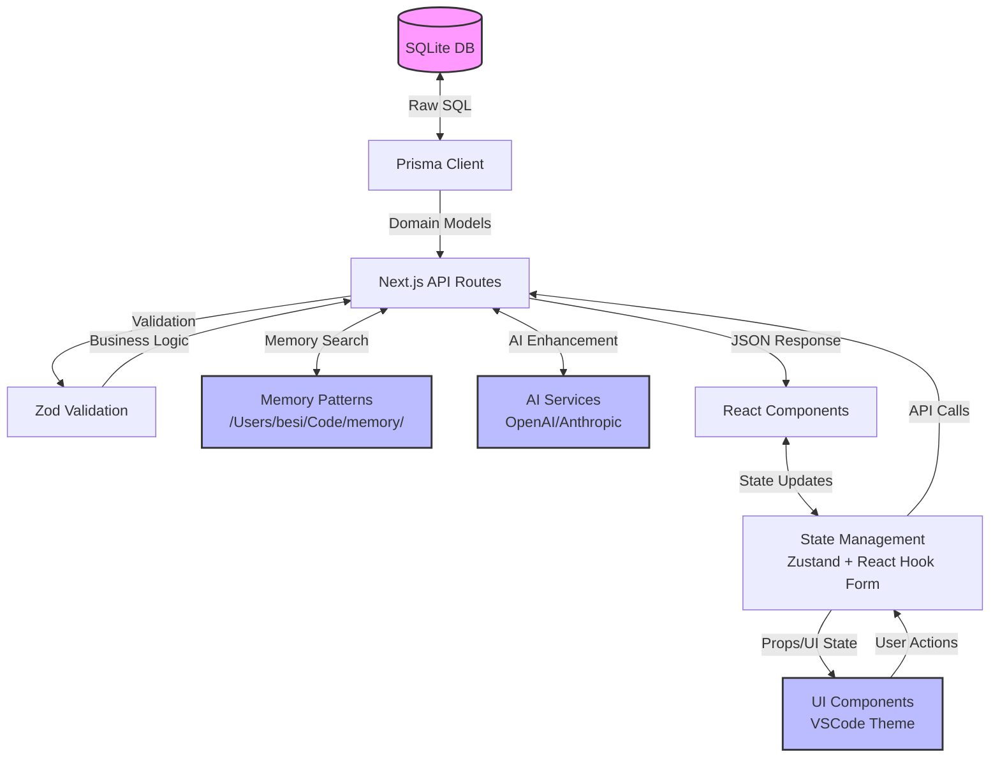

# Data Model Documentation

> Generated on: 2025-10-26
> Project: prompt-manager
> Tech Stack: Next.js 15.1.3, React 18, TypeScript, Prisma 6.1.0, SQLite, Zustand 5.0.2, Zod 3.24.1, Tailwind CSS

## Table of Contents
1. Database Schema ERD
2. Service Layer Models
3. UI Data Structures
4. End-to-End Data Flow

---

## 1. Database Schema ERD

### Overview
The application uses SQLite with Prisma ORM as the database layer. The schema is designed around a core Prompt entity with relationships to Categories and Tags for organization and classification. The system also tracks AI enhancements and integrates with a memory pattern system for cross-project knowledge sharing.

### Entity Relationship Diagram

```mermaid
erDiagram
    CATEGORY ||--o{ PROMPT : contains
    PROMPT ||--o{ PROMPT_TAG : has
    TAG ||--o{ PROMPT_TAG : belongs_to
    
    CATEGORY {
        string id PK
        string name UK
        string color
        string icon
        boolean isDefault
        datetime createdAt
        datetime updatedAt
    }
    
    PROMPT {
        string id PK
        string title
        string content
        string description
        string color
        string categoryId FK
        boolean isEnhanced
        string originalContent
        string enhancedBy
        string memoryPatternsUsed
        datetime createdAt
        datetime updatedAt
    }
    
    TAG {
        string id PK
        string name UK
        datetime createdAt
    }
    
    PROMPT_TAG {
        string promptId PK,FK
        string tagId PK,FK
    }
    
    %% Indexes
    CATEGORY {
        @@index(name)
    }
    
    PROMPT {
        @@index(categoryId)
        @@index(isEnhanced)
    }
    
    PROMPT_TAG {
        @@id(promptId, tagId)
    }
```

### Table Definitions

#### Category
- **Purpose:** Organizes prompts into logical groups (Cloud, JS, Frontend, Backend, etc.)
- **Columns:**
  - `id` (String, PRIMARY KEY, cuid()) - Unique identifier for the category
  - `name` (String, UNIQUE, NOT NULL) - Human-readable category name
  - `color` (String, NOT NULL) - VSCode-style color code for UI theming
  - `icon` (String, NULLABLE) - Lucide icon name for UI representation
  - `isDefault` (Boolean, DEFAULT false) - Marks predefined system categories
  - `createdAt` (DateTime, DEFAULT now()) - Creation timestamp
  - `updatedAt` (DateTime, AUTO_UPDATE) - Last modification timestamp
- **Indexes:**
  - `idx_name` on `name` (unique)
- **Foreign Keys:**
  - None
- **Notes:** Predefined categories are seeded on first run (Cloud, JS, Bugs, Frontend, Backend, Plan)

#### Prompt
- **Purpose:** Core entity storing AI prompts with enhancement tracking
- **Columns:**
  - `id` (String, PRIMARY KEY, cuid()) - Unique identifier
  - `title` (String, NOT NULL) - Human-readable prompt title
  - `content` (String, NOT NULL) - The actual prompt text/content
  - `description` (String, NULLABLE) - Optional description of the prompt's purpose
  - `color` (String, NOT NULL, DEFAULT "#007ACC") - VSCode-style color for UI theming
  - `categoryId` (String, FOREIGN KEY, NULLABLE) - Reference to Category for organization
  - `isEnhanced` (Boolean, DEFAULT false) - Tracks if prompt was AI-enhanced
  - `originalContent` (String, NULLABLE) - Stores original content before AI enhancement
  - `enhancedBy` (String, NULLABLE) - AI model identifier used for enhancement
  - `memoryPatternsUsed` (String, NULLABLE) - JSON array of memory pattern IDs used
  - `createdAt` (DateTime, DEFAULT now()) - Creation timestamp
  - `updatedAt` (DateTime, AUTO_UPDATE) - Last modification timestamp
- **Indexes:**
  - `idx_categoryId` on `categoryId` (for category filtering)
  - `idx_isEnhanced` on `isEnhanced` (for enhancement tracking)
- **Foreign Keys:**
  - `categoryId` references `Category.id` (SET NULL on delete)
- **Notes:** Supports version tracking through originalContent field and integrates with memory patterns

#### Tag
- **Purpose:** Flexible tagging system for prompt categorization and search
- **Columns:**
  - `id` (String, PRIMARY KEY, cuid()) - Unique identifier
  - `name` (String, UNIQUE, NOT NULL) - Tag name
  - `createdAt` (DateTime, DEFAULT now()) - Creation timestamp
- **Indexes:**
  - `idx_name` on `name` (unique)
- **Foreign Keys:**
  - None
- **Notes:** Tags are created automatically when assigned to prompts

#### PromptTag (Join Table)
- **Purpose:** Many-to-many relationship between prompts and tags
- **Columns:**
  - `promptId` (String, PRIMARY KEY, FOREIGN KEY) - Reference to Prompt
  - `tagId` (String, PRIMARY KEY, FOREIGN KEY) - Reference to Tag
- **Indexes:**
  - Composite primary key on (`promptId`, `tagId`)
- **Foreign Keys:**
  - `promptId` references `Prompt.id` (CASCADE on delete)
  - `tagId` references `Tag.id` (CASCADE on delete)
- **Notes:** Allows multiple tags per prompt and multiple prompts per tag

---

## 2. Service Layer Models

### Overview
The service layer uses Zod schemas for validation and TypeScript interfaces for type safety. API routes handle business logic and data transformation between database entities and client-facing DTOs.

### Data Transfer Objects (DTOs)

#### Request DTOs

**CreatePromptInput**
```typescript
interface CreatePromptInput {
  title: string;           // Required, 1-200 characters
  content: string;         // Required, any length
  description?: string;    // Optional, nullable
  color: string;           // Required, hex color format (#RRGGBB)
  categoryId?: string;     // Optional, nullable
  tags?: string[];         // Optional, array of tag names
}
```

**Validation Rules:**
- `title`: Required, min 1 character, max 200 characters
- `content`: Required, non-empty string
- `description`: Optional, nullable string
- `color`: Required, regex pattern `^#[0-9A-Fa-f]{6}$` (hex color)
- `categoryId`: Optional, nullable string
- `tags`: Optional, array of strings (tag names)

**UpdatePromptInput**
```typescript
interface UpdatePromptInput {
  id: string;              // Required for identification
  title?: string;          // Optional update
  content?: string;        // Optional update
  description?: string;    // Optional update
  color?: string;          // Optional update
  categoryId?: string;     // Optional update
  tags?: string[];         // Optional update
}
```

**CreateCategoryInput**
```typescript
interface CreateCategoryInput {
  name: string;            // Required, 1-50 characters
  color: string;           // Required, hex color format
  icon?: string;           // Optional, nullable
}
```

**Validation Rules:**
- `name`: Required, min 1 character, max 50 characters
- `color`: Required, hex color format
- `icon`: Optional, nullable string (Lucide icon name)

**EnhancePromptRequest**
```typescript
interface EnhancePromptRequest {
  originalPrompt: string;  // Required, prompt to enhance
  category?: string;       // Optional, category context
  tags?: string[];         // Optional, tag context
  memoryPatternIds?: string[]; // Optional, specific patterns to use
  modelId?: number;        // Optional, AI model selection
  includeMemory?: boolean; // Optional, include memory search
  promptTitle?: string;    // Optional, prompt title for context
}
```

#### Response DTOs

**Prompt Response**
```typescript
interface Prompt {
  id: string;
  title: string;
  content: string;
  description: string | null;
  color: string;
  categoryId: string | null;
  category?: Category | null;
  tags: Tag[];
  isEnhanced: boolean;
  originalContent: string | null;
  enhancedBy: string | null;
  memoryPatternsUsed: string | null;
  createdAt: Date;
  updatedAt: Date;
}
```

**Category Response**
```typescript
interface Category {
  id: string;
  name: string;
  color: string;
  icon: string | null;
  isDefault: boolean;
  createdAt: Date;
  updatedAt: Date;
  _count?: {
    prompts: number;      // Optional, for UI statistics
  };
}
```

**Tag Response**
```typescript
interface Tag {
  id: string;
  name: string;
  createdAt: Date;
}
```

**EnhancePromptResponse**
```typescript
interface EnhancePromptResponse {
  enhancedPrompt: string;     // The AI-enhanced prompt content
  model: string;              // AI model used for enhancement
  memoryPatternsUsed: string[]; // Array of pattern IDs used
  suggestions?: string[];     // Optional improvement suggestions
}
```

### Domain Models

**AI Configuration**
```typescript
interface AIModelConfig {
  model_display_name: string; // Human-readable model name
  model: string;              // API model identifier
  base_url: string;           // API endpoint URL
  api_key: string;            // API authentication key
  provider: 'openai' | 'anthropic'; // AI provider
}

interface AIConfig {
  custom_models: AIModelConfig[]; // Array of configured AI models
}
```

**Memory Patterns (Cross-Project Knowledge)**
```typescript
interface SuccessPattern {
  id: string;
  pattern_name: string;
  use_case: string;
  implementation: string;
  technologies: string[];
  benefits: string[];
  tradeoffs: string[];
  code_example?: string;
}

interface FailurePattern {
  id: string;
  date: string;
  problem: string;
  symptoms: string[];
  root_cause: string;
  solution: string;
  technologies: string[];
  prevention: string;
  diagnostic_commands?: string[];
}

interface ProjectTemplate {
  id: string;
  name: string;
  category: string;
  description: string;
  tech_stack: Record<string, string[]>;
  file_structure?: Record<string, any>;
}

interface MemoryMatch {
  pattern: SuccessPattern | FailurePattern | ProjectTemplate;
  type: 'success' | 'failure' | 'template';
  relevanceScore: number;
  matchedKeywords: string[];
}
```

**Business Rules:**
- Category names must be unique across the system
- Tag names are case-sensitive and automatically created on use
- Prompt colors default to VSCode blue (#007ACC) if not specified
- Original content is preserved when prompts are AI-enhanced
- Memory patterns are stored in `/Users/besi/Code/memory/` directory
- AI enhancement tracks both the model used and memory patterns applied

---

## 3. UI Data Structures

### Overview
The frontend uses React with TypeScript, Zustand for state management, and React Hook Form with Zod validation. Components follow a VSCode Dark Theme design system.

### Component Props

**PromptForm Component**
```typescript
interface PromptFormProps {
  prompt?: (Prompt & { category: Category | null; tags: Tag[] }) | null;
  onSubmit: (data: CreatePromptInput) => Promise<void>;
  onCancel: () => void;
}
```

**PromptDialog Component**
```typescript
interface PromptDialogProps {
  isOpen: boolean;
  onClose: () => void;
  prompt?: Prompt & { category: Category | null; tags: Tag[] } | null;
  onSuccess: () => void;
}
```

**PromptCard Component**
```typescript
interface PromptCardProps {
  prompt: Prompt & { category: Category | null; tags: Tag[] };
  onEdit: (prompt: Prompt) => void;
  onDelete: (prompt: Prompt) => void;
  onEnhance: (prompt: Prompt) => void;
  viewMode: 'card' | 'list';
}
```

**PromptFilters Component**
```typescript
interface PromptFiltersProps {
  categories: Category[];
  selectedCategory: string | null;
  onCategoryChange: (categoryId: string | null) => void;
  searchQuery: string;
  onSearchChange: (query: string) => void;
  selectedTags: string[];
  onTagsChange: (tags: string[]) => void;
}
```

### State Management Schemas

**View Store (Zustand)**
```typescript
interface ViewStore {
  viewMode: 'card' | 'list';
  setViewMode: (mode: 'card' | 'list') => void;
}
```

**Global UI State Pattern**
```typescript
// Custom hooks for data fetching
interface UseCategoriesReturn {
  categories: Category[];
  isLoading: boolean;
  error: string | null;
  createCategory: (data: CreateCategoryInput) => Promise<void>;
  updateCategory: (id: string, data: UpdateCategoryInput) => Promise<void>;
  deleteCategory: (id: string) => Promise<void>;
}

interface UsePromptsReturn {
  prompts: (Prompt & { category: Category | null; tags: Tag[] })[];
  isLoading: boolean;
  error: string | null;
  createPrompt: (data: CreatePromptInput) => Promise<void>;
  updatePrompt: (id: string, data: UpdatePromptInput) => Promise<void>;
  deletePrompt: (id: string) => Promise<void>;
  enhancePrompt: (id: string, options: EnhancePromptRequest) => Promise<void>;
  filters: PromptFilters;
  setFilters: (filters: Partial<PromptFilters>) => void;
}
```

### Form Schemas

**Prompt Form Schema**
```typescript
interface PromptFormData {
  title: string;
  content: string;
  description?: string;
  color: string;
  categoryId?: string;
  tags: string[];
}
```

**Category Form Schema**
```typescript
interface CategoryFormData {
  name: string;
  color: string;
  icon?: string;
}
```

**Form Validation:**
- Client-side: Zod schema validation with react-hook-form
- Real-time validation on field blur and change
- Visual feedback with VSCode-style error colors
- Submit prevention for invalid forms

**UI Data Flow:**
1. Form input → Zod validation → API call
2. API response → Component state → UI update
3. Error handling → User feedback (toast notifications)
4. Loading states → Skeleton components / disabled buttons

---

## 4. End-to-End Data Flow

### Overview
Complete data flow from SQLite database through Prisma ORM and Next.js API routes to React components and back. The architecture includes AI enhancement integration and memory pattern matching.

### Data Flow Diagram



### Example Flow 1: Creating a New Prompt

**1. User fills form (UI Component)**
```typescript
// PromptForm component
const handleSubmit = async (data: CreatePromptInput) => {
  await onSubmit(data); // Triggers parent handler
}
```

**2. Form validation and submission (React Hook Form + Zod)**
```typescript
// PromptDialog component
const handleSubmit = async (data: CreatePromptInput) => {
  const response = await fetch('/api/prompts', {
    method: 'POST',
    headers: { 'Content-Type': 'application/json' },
    body: JSON.stringify(data)
  });
}
```

**3. API route receives request (Next.js API)**
```typescript
// POST /api/prompts
export async function POST(request: NextRequest) {
  const body = await request.json();
  const validatedData = createPromptSchema.parse(body);
  // Process tags and create prompt...
}
```

**4. Business logic execution (Service Layer)**
```typescript
// Tag processing in API route
if (validatedData.tags && validatedData.tags.length > 0) {
  // Create new tags if they don't exist
  await prisma.tag.createMany({
    data: newTagNames.map((name: string) => ({ name }))
  });
}
```

**5. Database operation (Prisma ORM)**
```typescript
// Create prompt with relations
const prompt = await prisma.prompt.create({
  data: {
    title: validatedData.title,
    content: validatedData.content,
    // ... other fields
    tags: {
      create: validatedData.tags.map(tagName => ({
        tag: {
          connectOrCreate: {
            where: { name: tagName },
            create: { name: tagName }
          }
        }
      }))
    }
  },
  include: { category: true, tags: { include: { tag: true } } }
});
```

**6. Response transformation and UI update**
```typescript
// Transform nested relations to flat structure
const transformedPrompt = {
  ...prompt,
  tags: prompt.tags.map((tag: any) => tag.tag)
};
return NextResponse.json(transformedPrompt, { status: 201 });
```

### Example Flow 2: AI Prompt Enhancement

**1. User requests enhancement (UI Component)**
```typescript
// PromptEnhanceDialog
const handleEnhance = async (options: EnhancePromptRequest) => {
  const response = await fetch('/api/prompts/enhance', {
    method: 'POST',
    body: JSON.stringify(options)
  });
}
```

**2. Memory pattern search (Optional)**
```typescript
// POST /api/prompts/enhance
if (body.includeMemory && body.promptTitle) {
  const patterns = loadAllPatterns();
  memoryMatches = matchPatterns(patterns, {
    promptTitle: body.promptTitle,
    promptContent: body.originalPrompt,
    category: body.category,
    tags: body.tags,
  });
}
```

**3. AI enhancement service call**
```typescript
// lib/ai/enhance-prompt.ts
export async function enhancePrompt(
  request: EnhancePromptRequest,
  memoryMatches: MemoryMatch[]
): Promise<EnhancePromptResponse> {
  // Construct context from memory patterns
  // Call AI service with enhanced context
  // Return enhanced prompt with metadata
}
```

**4. Database update with enhancement tracking**
```typescript
// Update prompt with enhancement metadata
await prisma.prompt.update({
  where: { id: promptId },
  data: {
    content: enhancedPrompt,
    isEnhanced: true,
    originalContent: originalContent,
    enhancedBy: modelUsed,
    memoryPatternsUsed: JSON.stringify(patternIdsUsed)
  }
});
```

### Example Flow 3: Prompt Search and Filtering

**1. User applies filters (UI Components)**
```typescript
// PromptFilters component
const handleFilterChange = (filters: PromptFilters) => {
  setFilters(filters);
  // Trigger API call with new filter params
}
```

**2. API route with dynamic query building**
```typescript
// GET /api/prompts?categoryId=xxx&search=keyword&tags=tag1,tag2
export async function GET(request: NextRequest) {
  const { searchParams } = new URL(request.url);
  const categoryId = searchParams.get('categoryId');
  const search = searchParams.get('search');
  const tags = searchParams.get('tags')?.split(',').filter(Boolean);
  
  const where: any = {};
  if (categoryId) where.categoryId = categoryId;
  if (search) where.OR = [
    { title: { contains: search } },
    { content: { contains: search } },
    { description: { contains: search } }
  ];
  if (tags?.length) where.tags = {
    some: { tag: { name: { in: tags } } }
  };
}
```

**3. Optimized database query with includes**
```typescript
const prompts = await prisma.prompt.findMany({
  where,
  include: {
    category: true,
    tags: { include: { tag: true } }
  },
  orderBy: { updatedAt: 'desc' }
});
```

### Data Transformations

**Database Entity → API Response:**
- **Relations flattening:** Convert nested `PromptTag` relations to flat `Tag[]` array
- **Date formatting:** Ensure ISO 8601 string format for JSON serialization
- **Null handling:** Convert database nulls to appropriate TypeScript null/undefined
- **Type coercion:** Ensure database types match TypeScript interface expectations

**API Response → UI State:**
- **Client-side hydration:** Convert string dates back to Date objects if needed
- **State normalization:** Flatten nested objects for optimal React re-renders
- **Error boundary:** Handle API errors with user-friendly messages
- **Loading states:** Track async operations for UI feedback

**Form Data → Validation Schema:**
- **Type coercion:** Ensure form values match Zod schema expectations
- **Array handling:** Convert comma-separated strings to arrays for tags
- **Optional fields:** Handle nullable/optional form fields appropriately
- **Color validation:** Ensure hex color format compliance

---

## Data Validation Strategy

### Client-Side Validation
- **Zod schemas** for runtime type checking and validation
- **React Hook Form** integration for form-level validation
- **Real-time feedback** on field change and blur events
- **Visual validation indicators** using VSCode theme colors
- **Submit prevention** for invalid forms

### Server-Side Validation
- **Zod schema validation** in API routes for request body validation
- **Database constraint validation** through Prisma ORM
- **Business rule validation** in service layer logic
- **Input sanitization** for security (XSS prevention)
- **Error response standardization** with appropriate HTTP status codes

### Database Constraints
- **Primary keys:** CUID strings for all entities
- **Foreign keys:** Referential integrity with appropriate cascade rules
- **Unique constraints:** Category names, Tag names
- **Check constraints:** Color format validation at database level
- **Not null constraints:** Required fields enforced at database level
- **Indexes:** Performance optimization for frequently queried columns

---

## Performance Optimization

### Database Optimization
- **Strategic indexes** on categoryId, isEnhanced, and name fields
- **Query optimization** with proper include/select statements
- **Pagination support** ready for large datasets
- **Connection pooling** through Prisma client configuration

### Frontend Optimization
- **Lazy loading** for large prompt lists
- **Debounced search** to reduce API calls
- **State persistence** for view mode preferences
- **Memoized components** to prevent unnecessary re-renders
- **Optimistic updates** for better user experience

### API Optimization
- **Request validation** before database operations
- **Response transformation** to minimize data transfer
- **Error caching** for repeated invalid requests
- **Rate limiting** considerations for AI enhancement endpoints

---

## Security Considerations

### Input Validation
- **XSS prevention** through content sanitization
- **SQL injection prevention** via Prisma ORM parameterization
- **CSRF protection** through Next.js built-in mechanisms
- **Input length limits** enforced at both client and server levels

### Data Protection
- **API key management** for AI services (server-side only)
- **Environment variables** for sensitive configuration
- **Content Security Policy** considerations for markdown rendering
- **File system access** restricted to memory pattern directory

### Authentication & Authorization
- **Prepared for auth integration** with clear extension points
- **API route protection** ready for middleware implementation
- **User data isolation** architecture planned for multi-tenant support
- **Session management** considerations for future development

---

## Future Enhancements

### Planned Database Changes
- **User management** tables for multi-user support
- **Prompt versioning** for change tracking and rollback
- **Usage analytics** for prompt effectiveness tracking
- **Sharing/collaboration** features for prompt templates
- **Export/import** functionality for prompt collections

### AI Enhancement Improvements
- **Multiple AI provider support** with fallback mechanisms
- **Prompt optimization history** tracking
- **Custom AI model training** with user feedback
- **Batch enhancement** operations
- **Prompt performance metrics** collection

### UI/UX Enhancements
- **Advanced search** with syntax highlighting
- **Prompt preview** with live rendering
- **Drag-and-drop** organization for categories and prompts
- **Keyboard shortcuts** for power users
- **Mobile responsiveness** improvements

### Memory System Integration
- **Automatic pattern detection** from prompt usage
- **Community pattern sharing** capabilities
- **Pattern versioning** and updates
- **Performance impact tracking** of memory patterns
- **Cross-project pattern synchronization**

---

## Technology Integration Notes

### Prisma ORM Configuration
- **SQLite provider** for development simplicity and portability
- **Environment-based database URL** for deployment flexibility
- **Seed data** for default categories with VSCode theming
- **Migration strategy** ready for schema evolution

### Next.js Integration
- **App Router** architecture for modern React patterns
- **Server components** for data fetching optimization
- **API routes** for backend functionality
- **Static generation** ready for improved performance

### AI Service Integration
- **Multi-provider support** (OpenAI, Anthropic)
- **Custom model configuration** through JSON files
- **Memory pattern integration** for contextual enhancement
- **Error handling** with fallback mechanisms

### VSCode Theme Implementation
- **Consistent color palette** matching VSCode Dark theme
- **Semantic color usage** for states and feedback
- **Accessibility considerations** with contrast ratios
- **Component library** following VSCode design patterns

---

This documentation provides a comprehensive overview of the prompt-manager application's data architecture, covering the complete data flow from database to UI and the integration patterns used throughout the system.